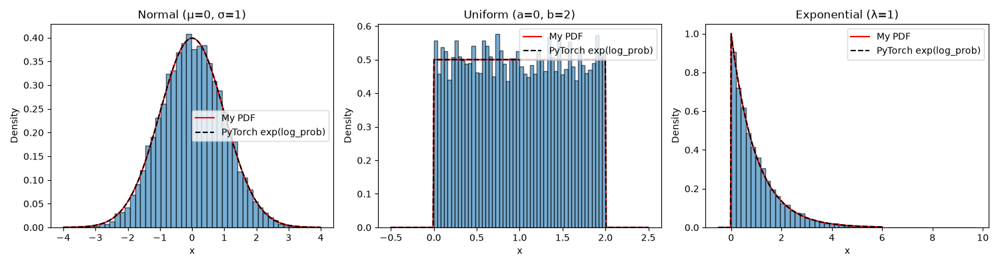

# First Light Project


## NumPy vs. PyTorch Precision

### Results

Output of `python plots.py`:

```
float 32 | allclose: False | max difference: 4.76837158203125e-07
float 64 | allclose: True | max difference: 1.7763568394002505e-15
```

| dtype   | allclose | max difference |
|---------|----------|----------------|
| float32 | False    | 4.77e-07       |
| float64 | True     | 1.78e-15       |

### Why float32 fails and float64 passes

float64 passes because its rounding error (10⁻¹⁵) is far below allclose’s tolerance. float32 fails because its rounding error (~10⁻⁷) is larger than allclose’s default absolute tolerance (10⁻⁸), which is too strict for float32.

### Precision plot


The plot shows how far float32 `sin(x)` is from float64 `sin(x)` at each point, on a log scale. The error is smallest near x = 0 and biggest out at the edges, near ±2π, where it pokes above float32 machine epsilon.

Most of the error comes from storing x itself in float32, not from `sin`. float32 keeps about 7 significant digits, so the rounding error in x grows with |x|: tiny near 0, largest near ±2π. 


## Shared Memory vs. Copies

| function              | before   | after |
|-----------------------|----------|-------|
| `torch.from_numpy()`  | 98       | 500   |
| `torch.tensor()`      | 98       | 98    |

When you turn a NumPy array into a tensor with `torch.from_numpy()`, the new tensor shares the same memory as the original NumPy array. When you create a tensor with `torch.tensor()`, it is independent and has its own location in memory.

- Use `torch.from_numpy()` when the data is large and you won’t modify the original, because it avoids a copy.
- Use `torch.tensor()` when the original might change and you need your own independent version.

## Noise Data


This figure uses 200 evenly spaced x values from 0 to 10. For y, I used 2x + 1 and added noise that I created with a standard deviation of 1.5. I added that noise to the y values to replicate real-life data, because real data isn't going to be a perfect straight line.

When I graphed it, I could clearly see the data points scatter above and below the true line.

### What the seed does

The seed controls the random numbers in the `tensor_1d` variable. When you use the same seed, you get the same random numbers on every run, so the figure is identical and the results are reproducible. Changing the seed changes those random numbers, so the data points move. The x values and the true line don't change, because I created them myself, not randomly.


## Distributions



10,000 samples each from a Normal, Uniform, and Exponential distribution. The red line is my own PDF written in NumPy, and the dashed line is PyTorch's density (exp of log_prob). 

### What density=True does
Without it, each bar's height is a raw count. density=True divides each count by (total samples × bin width), so the total area of all the bars is 1. 